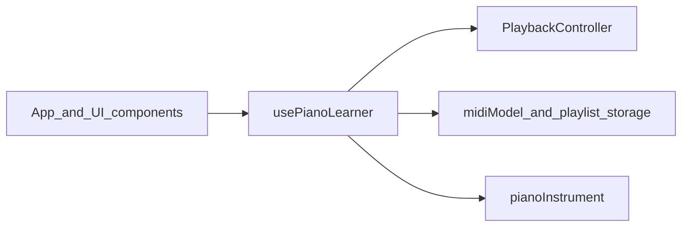

# Piano Learner — Product Requirements Document

This document describes product goals, architecture, subsystem boundaries, and traceable requirements. It complements the user-facing [README.md](README.md). Use it to triage bugs and to know which source files own which behavior.

---

## 1. Product summary

**Piano Learner** is a browser-based practice tool: users load **MIDI files** and see a **staff**, **falling-note waterfall**, and **on-screen keyboard** aligned in time. Audio uses a **soundfont** (acoustic grand). **Web MIDI** drives live notes; optional **MIDI controller bindings** handle transport and looping. Keyboard shortcuts (Space, arrows, Home) control transport only, not piano keys. **Practice modes** (`listen`, `follow`, `wait`) and **A/B loops** support structured practice. The app is a **PWA** and is deployed to **GitHub Pages**.

**Out of scope:** no backend server, no user accounts, no cloud file sync. All MIDI files and playlist data stay in the browser (IndexedDB / localStorage) unless the user exports or loads files manually.

---

## 2. Tech stack

| Layer | Technology |
|--------|------------|
| UI | React 19, TypeScript ~5.9 |
| Build | Vite 8, `@vitejs/plugin-react` |
| MIDI parsing | `@tonejs/midi` |
| Audio | Web Audio API via `smplr` soundfonts — see `src/audio/pianoInstrument.ts` |
| Offline / install | `vite-plugin-pwa` (service worker, web app manifest) |
| Quality | ESLint 9, TypeScript ESLint |

**Scripts:** `npm run dev`, `npm run build` (`tsc -b && vite build`), `npm run lint`, `npm run preview`.

---

## 3. Architecture (high level)

Most application behavior is orchestrated in **`usePianoLearner`**: it owns `AudioContext`, the `PlaybackController`, loaded MIDI state, playlist persistence, hardware binding state, and keyboard/shortcuts. **`App.tsx`** composes the layout (transport, timeline, keybed, settings) and wires UI to the hook; heavy logic stays out of presentational components where possible.

---

## 4. Subsystem breakdown

Shared domain types (`PracticeMode`, `HandFilter`, `LoopSnap`, `LoopRegion`, `ParsedMidiTrackInfo`, `NoteView`) live in **`src/types.ts`**.

| Name | Responsibility | Primary files | User-visible surface |
|------|----------------|---------------|----------------------|
| **Bootstrap / shell** | HTML shell, React root, PWA service worker registration | `index.html`, `src/main.tsx` | First paint, installability, offline caching |
| **App shell & layout** | Transport bar, open file, playlist UI, settings entry, composition of waterfall/staff/keybed | `src/App.tsx`, `src/App.css` | Main screen layout, transport controls, file/playlist actions |
| **Orchestration hook** | MIDI load, audio init, transport, practice mode, loop wiring, Web MIDI input, playlist + IndexedDB/localStorage | `src/hooks/usePianoLearner.ts` | End-to-end behavior across features; shortcut handling (e.g. Space, arrows, Home) |
| **Playback engine** | Scheduling, listen/follow/wait, hand split, A/B loop, wait-for-note grouping | `src/engine/playbackController.ts`, `src/engine/onsetGroups.ts`, `src/engine/loopSnap.ts`, `src/engine/fingering.ts` | Playback correctness, practice feedback, loop boundaries |
| **MIDI domain** | Track normalization, note lists for practice/UI, staff geometry | `src/midi/midiModel.ts`, `src/midi/staffLayout.ts` | Which tracks/notes appear; staff layout |
| **Persistence** | Store MIDI blobs (IndexedDB), playlist order/metadata (localStorage) | `src/midi/midiPlaylistStorage.ts` | Playlist survives reloads; stored songs |
| **MIDI hardware** | Learn/bind Play, Stop, Record (loop), loop start/end CCs; monitor message formatting | `src/midi/midiHardwareBindings.ts`, `src/midi/midiMonitorFormat.ts` | Settings → MIDI hardware; live MIDI log |
| **Audio** | Soundfont loading, note on/off for preview and playback | `src/audio/pianoInstrument.ts` | “Tap to enable audio”, load progress, piano timbre |
| **Timeline / visualization** | Waterfall, staff canvas, aligned keybed, time ↔ sheet mapping, timeline layout constants | `src/ui/WaterfallPianoRoll.tsx`, `src/ui/StaffCanvas.tsx`, `src/ui/AlignedKeybed.tsx`, `src/ui/MusicTimeline.tsx`, `src/ui/sheetTimeMapping.ts`, `src/ui/pianoKeyLayout.ts`, `src/ui/timelineConstants.ts` | Scrolling notes, seeking, key highlights, sheet/loop overlays |
| **Settings / mapping UI** | Settings modal (tracks, modes, latency, etc.); MIDI mapping panel | `src/ui/SettingsModal.tsx`, `src/ui/MidiMappingPanel.tsx` | Gear menu, learn/bind UI |

---

## 5. Functional requirements (checklist)

Use these as traceability anchors when filing or fixing bugs.

- **MIDI file**
  - Open a `.mid` / `.midi` file from disk; show filename and duration.
  - Select one or more tracks for practice; summaries reflect parsed content.
- **Transport**
  - Play / pause (UI and Space where not blocked by modals / learn mode).
  - Seek by interacting with the waterfall/timeline; scrub with ← / → by a fixed step (`ARROW_NUDGE_SEC` = 0.5 s in `usePianoLearner`).
  - Jump to start (Home / control).
- **Practice**
  - Modes: `listen` | `follow` | `wait` (see `PracticeMode` in `src/types.ts`).
  - Hand filter: `both` | `left` | `right`.
  - A/B loop region; optional loop snap (`LoopSnap`: off / beat / bar).
- **Input**
  - Enumerate Web MIDI inputs; display device name when available.
  - Optional hardware bindings for Play, Stop, Record (loop toggle), loop range controls.
- **Playlist**
  - Add/remove/reorder items; persist playlist and blobs across sessions.
- **Audio**
  - Require user gesture before audio starts; show soundfont load progress when applicable.

---

## 6. Non-functional requirements

- **PWA / offline:** `vite-plugin-pwa` registers the service worker with `registerType: 'autoUpdate'`. Workbox precaches static assets (`globPatterns` in `vite.config.ts`). Base path can follow `BASE_PATH` for GitHub Pages subpaths.
- **Browsers:** Web MIDI is required for USB MIDI; Chrome and Edge are the primary targets (see README).
- **Privacy / data:** MIDI files and playlist data are stored locally in the browser; no server upload in-app.

---

## 7. Bug backlog

Tag each issue with a **subsystem** so fixes land in the right layer:

| Tag | Typical area |
|-----|----------------|
| `bootstrap` | `index.html`, `main.tsx`, SW |
| `app-shell` | `App.tsx`, layout/CSS |
| `hook` | `usePianoLearner.ts` |
| `engine` | `src/engine/*` |
| `midi-model` | `midiModel.ts`, `staffLayout.ts` |
| `storage` | `midiPlaylistStorage.ts` |
| `hardware` | `midiHardwareBindings.ts`, `midiMonitorFormat.ts` |
| `audio` | `pianoInstrument.ts` |
| `ui-timeline` | Waterfall, staff, keybed, `MusicTimeline`, mapping helpers |
| `settings` | `SettingsModal.tsx`, `MidiMappingPanel.tsx` |

### Bug table (template)

Fill in rows as you discover issues. Sort by `Subsystem` before a fix pass.

| ID | Short description | Subsystem | Severity | Steps to reproduce | Suspected file(s) | Status |
|----|-------------------|-----------|----------|-------------------|---------------------|--------|
| | | | | | | |

**Severity (suggested):** Blocker / High / Medium / Low.

**Status (suggested):** Open / In progress / Fixed / Won’t fix.

---

## 8. Related links

- **User guide (controls, install, run from source):** [README.md](README.md)
- **Looper internals (A/B loop, state, MIDI, engine):** [docs/looper.md](docs/looper.md)
- **Deploy (GitHub Pages):** [.github/workflows/deploy-pages.yml](.github/workflows/deploy-pages.yml)
- **Live app:** [https://nesfrk81.github.io/PianoLearner/](https://nesfrk81.github.io/PianoLearner/)
